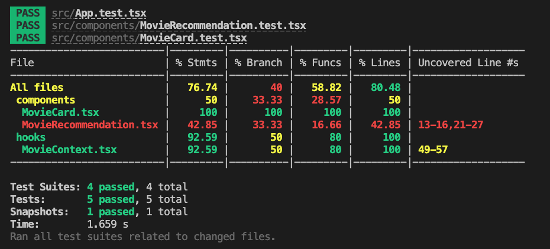

## How to start this ptoject!

# Note This project was created using node version **v17.4.0**

## clone the branch

```
git clone https://github.com/Milan-960/Tinder-for-movies.git
```

## Install dependecies

```
npm install
```

## run on the localhost

```
npm start
```

## run the test

```
npm test
```

## Home Page

&nbsp;
&nbsp;

## Code Coverage

&nbsp;
&nbsp;

## Things which has been implemented to the repo

- ✅ Show movie titles, image, summary, and rating: (fulfilled using the context provider and MovieCard component)

- ✅ Accept or reject the suggestion: (implemented with acceptMovie and rejectMovie functions)

- ✅ Notify backend with PUT calls: (simulated behavior; you'll need a real backend with appropriate endpoints)

- ✅ Structured like a modern JavaScript application: (React components, context provider, hooks)

- ✅ Mobile and desktop compatibility: (ASK responsive CSS) React, Jest, react-testing-library, React hooks, TypeScript

- ✅ Push code to public GitHub, run tests, and linter with GitHub Actions

- ✅ Bundle files and deploy to GitHub Pages

- ✅ Usage of context provider: (used for data fetching and state management)

- ✅ Testing data fetching logic
