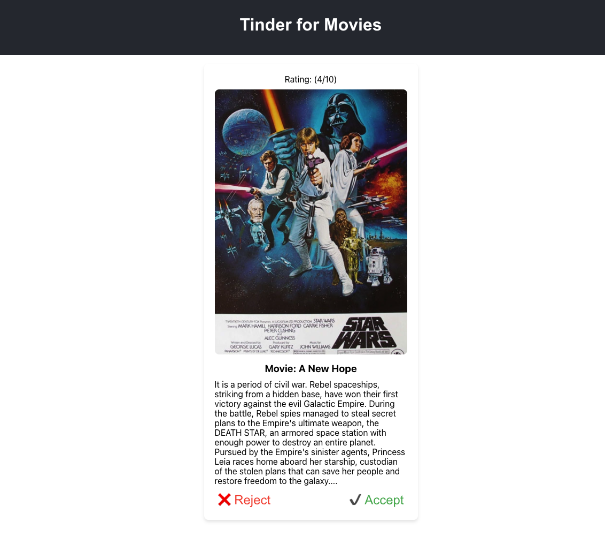

## How to start this ptoject!

# Note This project was created using node version **v17.4.0**

## clone the branch

```
git clone https://github.com/Milan-960/Tinder-for-movies.git
```

## Install dependecies

```
npm install
```

## run on the localhost

```
npm start
```

## run the test

```
npm test
```

## Home Page

&nbsp;
&nbsp;

## Code Coverage

&nbsp;
&nbsp;
